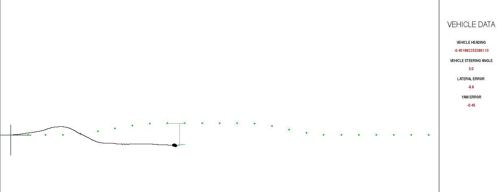

## Small Vehicle Simulation for Reinforcement Learning

This repo contains the simulation I wrote for my final year project. This simulation was used to train a Deep Q-Network
which was eventually used as control system for the Soft Target Platform of the Vehicle Dynamics Groups at the 
University of Pretoria.

The goal was to develop a controller for a small electric vehicle which was to be used as a 'dummy' vehicle during 
collision avoidance tests. The vehicle would be required to follow a prescribed path, consisting of GPS coordinates,
at a constant speed.


## Project Abstract
Autonomous vehicle systems have been the focus of many research teams in recent years. Various systems have already 
been developed which allow for different levels of autonomous control of vehicles. The testing of these systems is an 
expensive endeavour, as collisions can result in costly repairs to the vehicles being tested. A “soft target platform” 
is a small electric vehicle platform on which a form body can be mounted to resemble an actual vehicle. This platform 
can then be used in collision avoidance tests as colliding with the foam body won’t result in any damage to the vehicle 
being tested. This platform can be given a predetermined path (in the form of coordinates) to follow, using a GPS 
device to obtain its position during operation.

### Simulation and Controller Design
Various tests measured were made of the real-world Soft Target Platform at the University fo Pretoria, in order to 
determine the kinematic properties of the vehicle (Moment of Inertia, Force vs. Slip Angle of the wheels etc.). These 
values were used to create a kinematic model of the vehicle on which the simulation is based.



The controller is a Deep Q-Network that was trained using experience replay, with a decaying explore-exploit ratio 
(epsilon), and a fixed discounting factor (gamma). 

The observation/state space consists of 2 values:
1. The Lateral Error 
2. The Yaw Error 

both taken at a set preview distance in front of the vehicle.

The action space consists of the following steering angles:
1. 10 degrees left
2. 5 degrees left
3. 0 degrees i.e. straight
4. 5 degrees left
5. 10 degrees left

Given the current state, the DQN estimates the optional action to take, subject to a reward function. The reward 
function is given by the following code:

```python
reward = abs(previous_lateral_error) - abs(lateral_error) * 50
```

#### Running a pretrained model:
Executing the 'run_model.py' script will perform a simulation of the vehicle with a pretrained DQN as controller 
(default model is the final model I used for the real world tests).

#### Training a model:
Executing the `train_path_model.py` script will startup the simulation and train a new DQN model. The script contains 
parameters at which can be modified to change the simulation settings. (Note: This takes a while. I haven't had the 
time to optimise this part yet.)


